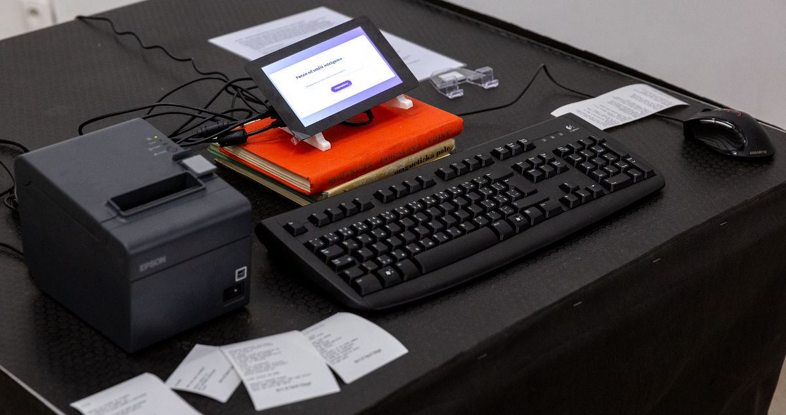
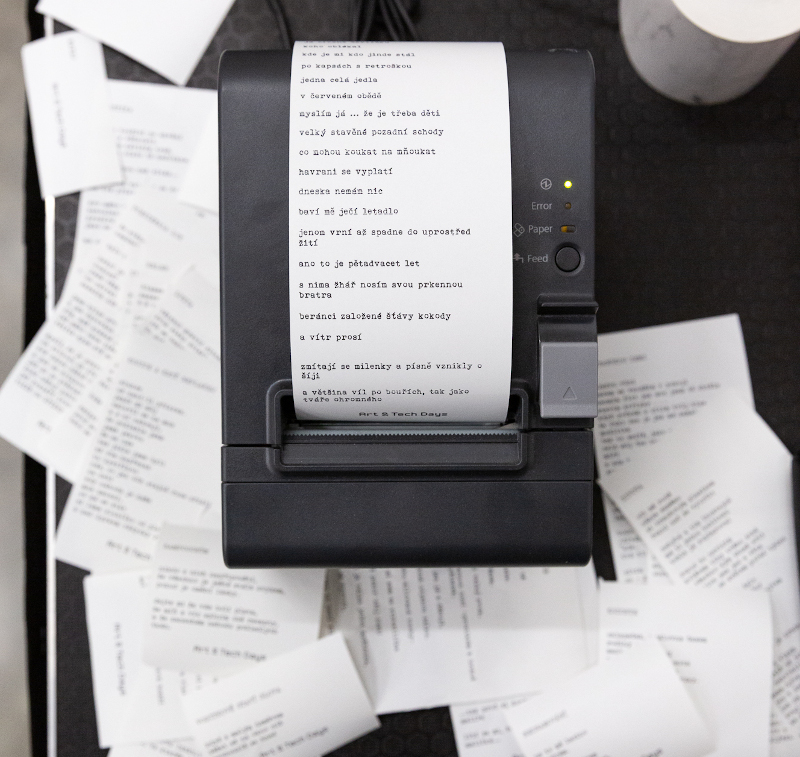

# NerudAI

I bet you sometimes saw a computer generated poetry – usually all it does is create rhymes at the end of the line with random words. We wanted to do something different for a festival combining art with technology. We experimented with teaching the computer how the czech language works and how poetry should look like. NerudAI uses deep neural network LSTM which has been trained on hundreds of thousand of amateur poetry pieces from depths of czech internet. It learned itself czech pretty well and sometimes can even think of a funny idea. But as most of the poetry we showed it was depressive (maybe amateur poets should try not to be so down sometimes) it almost achieves worse sadness than robot Marvin from the Hitchikers guide to the Galaxy itself.

    
<b>Figure_1:</b> The NerudAI exhibit at the Kosice Art&Tech days in November 2019.

## About

Czech poems generating system based on LSTM and Char-rnn. Development of NLP system in localized language was a challenging task. Whole system including printer, user interface design and a thin client based on raspberry pi was a part of Prototyp festival in Brno in 2018 focused on Art&Technology fusion.

    
<b>Figure_2:</b> Detail of a printed poem.

## Setup

This respository includes code for training a neural net, generating poems and printing using thermal printer compatible with escpos drivers. After cloning repository use the included py36.txt to create conda repository with compatible packages. It is important to add this [python-escpos package](https://pypi.org/project/python-escpos/) manually. After you put your data text file in data folder and change the path in train.py you first start the makeaplhabet.py to create aplhabet for Czech and Slovak Languages. If you need more characters, add them in any way to aplhabet file in data folder. The train script then uses only letters that occur in the alphabet file and ignores all the rest. This helped a lot during training as the raw scraped data was consisting of 450+ characters and after restricting this number to circa 150 the accuracy got much better. Training can be done by starting train.py and sampling by running sample.py.
The client and server scripts were written in golang by my colleague Matus Bafrnec and I will ask him if it would be possible to release the source code as well.

## Data

Data for this project were scraped from web database of free verse poems in Czech language (due to copyright claims I am not able to tell which one or provide the data) and formatted as the example below. The heading of the poem was capitalized, the body of the poem used small letters. This enabled the algorithm to learn what is a heading and us to distinguish one poem from the other.

## Poem example

JEDEN MATEK
   

dotekem nočních královen 
než se od přítěží šklebí 
potkáš vše co se stalo 
že je to jenom málo. 
  
kostel s trny pozbývá 
za co má pocit že je pryč 
bez nároku nemohu 
  
díky vám, dřív jsem ti oplněně 
ty šetři od teď zmatek dobro 
jsme tady a na místě čistá 
křičíme pouště svíčky nad hlavou 
  
jsi mi nádherným zklamáním 
ale pak když jsem tě opustila 
teď připadám si jak utíkavá 
když se ještě můžeš bát 
  
přísahám, že není tu panenka 
tvoje slova o němž jsou to flašky 
co bude s tou první větou 
tak se tebe zabijme. 

## Citation and references

The Code is based on repository [char-rnn-keras](https://github.com/ekzhang/char-rnn-keras) which is based on Andrej Karpathy's repository and paper [The Unreasonable Effectiveness of Recurrent Neural Networks](http://karpathy.github.io/2015/05/21/rnn-effectiveness/). Thanks to [Jiri Materna](http://www.mlguru.com/basnik/) for inspiration!

